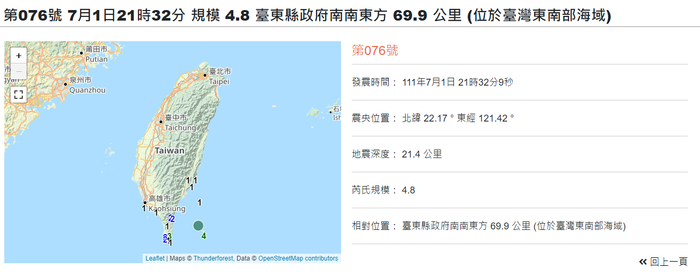
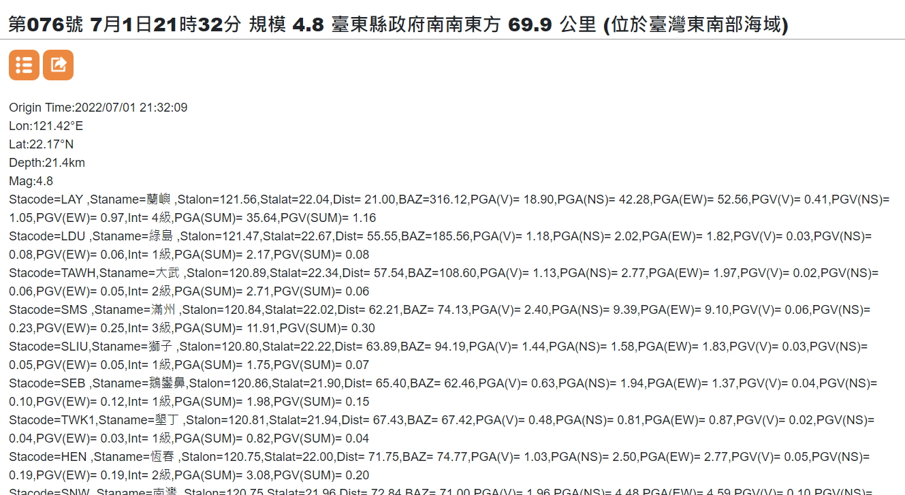
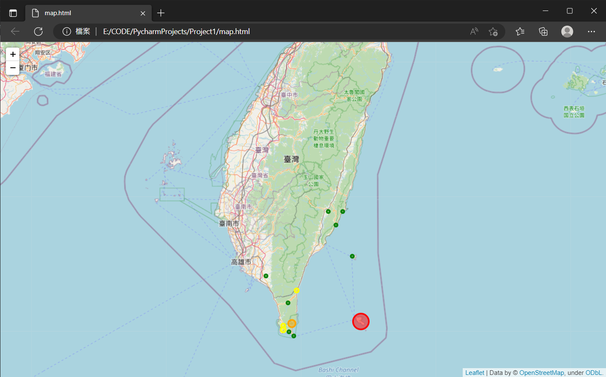

# Python 教學專案一

## 網路協定
### 超文本傳輸協定（HTTP）
全文：**超文本傳輸協定** [維基百科](https://en.wikipedia.org/wiki/Hypertext_Transfer_Protocol)

### HTTP 回應
所有 HTTP 回應的第一行是狀態行，由目前的 HTTP 版本號、三位數狀態碼和狀態描述短語組成，以空格分隔。
:::info
#### 狀態碼
狀態碼的第一位數字代表回應的類別：
```
1xx 資訊性 — 已收到請求，正在繼續處理
2xx 成功 — 請求已成功接收、理解和接受
3xx 重新導向 — 需要進一步操作才能完成請求
4xx 客戶端錯誤 — 請求包含錯誤語法或無法實現
5xx 伺服器錯誤 — 伺服器無法實現有效請求
```
:::

### 客戶端請求
```htmlmixed=
GET / HTTP/1.1
Host: www.google.com
```

### 伺服器回應
```htmlmixed=
HTTP/1.1 200 OK
Content-Length: 3059
Server: GWS/2.0
Date: Sat, 11 Jan 2003 02:44:04 GMT
Content-Type: text/html
Cache-Control: private
Set-Cookie: PREF=ID=73d4aef52e57bae9:TM=1042253044:LM=1042253044:S=SMCc_HRPCQiqyX9j; expires=Sun, 17-Jan-2038 19:14:07 GMT; path=/; domain=.google.com
Connection: keep-alive
```

### 超文本傳輸安全協定（HTTPS）
全文：**超文本傳輸安全協定** [維基百科](https://en.wikipedia.org/wiki/HTTPS)

:::warning
HTTP 不安全，攻擊者可以通過竊聽和中間人攻擊等方法攔截和操縱通訊。HTTPS 旨在防止此類攻擊，在正確配置時是安全的。
:::

## 台灣地震資料收集和視覺化
### [中央氣象局](https://www.cwb.gov.tw/V8/C/)

### 編號地震 - 地震參數下載
[事件 076：7月1日 21:32，規模 4.8，台東縣政府東南南 69.9 公里（台灣東南海域）](https://scweb.cwb.gov.tw/zh-tw/earthquake/parameters/2022070121320948076)


### TXT 下載網址


```
https://scweb.cwb.gov.tw/zh-tw/earthquake/download?file=%2FdrawTrace%2Foutcome%2F2022%2F2022076.txt
```

#### 注意網址的後半部分
```
file=%2FdrawTrace%2Foutcome%2F2022%2F2022076.txt
```

#### 觀察格式
```
file=%2FdrawTrace%2Foutcome%2F[年份]%2F[年份][編號].txt
```

#### 建立基礎網址格式
```python
base_URL = 'https://scweb.cwb.gov.tw/zh-tw/earthquake/download?file=%2FdrawTrace%2Foutcome%2F{:04d}%2F{:04d}{:03d}.txt'
```
在字串中，**{}** 是要填入值的佔位符。
1. **{:04d}**：`d` 代表整數，`4` 表示四位數，`0` 表示必要時用零填充。這是用於年份。
2. **{:03d}**：`d` 代表整數，`3` 表示三位數，`0` 表示必要時用零填充。這是用於地震編號。

#### 生成實際網址
```python
year = 2022  # 年份
index = 76   # 編號
URL = base_URL.format(year, year, index)  # 網址
```
使用 **format** 將對應的值插入字串中的佔位符以生成網址。
```python
print(URL)
```
```shell
https://scweb.cwb.gov.tw/zh-tw/earthquake/download?file=%2FdrawTrace%2Foutcome%2F2022%2F2022076.txt
```

### 獲取 TXT 資料
#### 使用 requests
我們需要使用 **requests** 函式庫來獲取資料。
```python
import requests

response = requests.get(URL)  # 回應物件
# 回應的文字內容（字串，編碼：ANSI）
Text = response.content.decode('ansi')
```
用 **換行符（\n）** 分割字串並移除 **\r**
```python
Text_List = Text.replace('\r','').split('\n')
```
印出前幾行資訊
```python
print(Text_List[0])  # 震央
print(Text_List[1])  # 經度
print(Text_List[2])  # 緯度
print(Text_List[3])  # 深度
print(Text_List[4])  # 規模
```
```shell
Origin Time:2022/07/01 21:32:09
Lon:121.42°E
Lat:22.17°N
Depth:21.4km
Mag:4.8
```
後續行包含來自各測站的 **地震觀測資料**，稱為 **data**。
處理和清理資料。
```python
# 將 Text_List 的其餘部分視為資料
data = Text_List[5:]
# 用 ',' 分割每個資料字串
data = [d.split(',') for d in data]
# 用 '=' 分割資料中的每個參數並去除空格
data = [[i.replace(' ','').split('=') for i in d] for d in data]
# 從具有鍵值對的參數建立字典
data = [{i[0]:i[1] for i in d if len(i)==2} for d in data]
# 移除空字典
data = [d for d in data if d!={}]
# 輸出清理後的資料
for d in data:
    print(d)
```
```shell=
{'Stacode': 'LAY', 'Staname': '蘭嶼', 'Stalon': '121.56', 'Stalat': '22.04', 'Dist': '21.00', 'BAZ': '316.12', 'PGA(V)': '18.90', 'PGA(NS)': '42.28', 'PGA(EW)': '52.56', 'PGV(V)': '0.41', 'PGV(NS)': '1.05', 'PGV(EW)': '0.97', 'Int': '4級', 'PGA(SUM)': '35.64', 'PGV(SUM)': '1.16'}
{'Stacode': 'LDU', 'Staname': '綠島', 'Stalon': '121.47', 'Stalat': '22.67', 'Dist': '55.55', 'BAZ': '185.56', 'PGA(V)': '1.18', 'PGA(NS)': '2.02', 'PGA(EW)': '1.82', 'PGV(V)': '0.03', 'PGV(NS)': '0.08', 'PGV(EW)': '0.06', 'Int': '1級', 'PGA(SUM)': '2.17', 'PGV(SUM)': '0.08'}
{'Stacode': 'TAWH', 'Staname': '大武', 'Stalon': '120.89', 'Stalat': '22.34', 'Dist': '57.54', 'BAZ': '108.60', 'PGA(V)': '1.13', 'PGA(NS)': '2.77', 'PGA(EW)': '1.97', 'PGV(V)': '0.02', 'PGV(NS)': '0.06', 'PGV(EW)': '0.05', 'Int': '2級', 'PGA(SUM)': '2.71', 'PGV(SUM)': '0.06'}
{'Stacode': 'SMS', 'Staname': '滿州', 'Stalon': '120.84', 'Stalat': '22.02', 'Dist': '62.21', 'BAZ': '74.13', 'PGA(V)': '2.40', 'PGA(NS)': '9.39', 'PGA(EW)': '9.10', 'PGV(V)': '0.06', 'PGV(NS)': '0.23', 'PGV(EW)': '0.25', 'Int': '3級', 'PGA(SUM)': '11.91', 'PGV(SUM)': '0.30'}
{'Stacode': 'SLIU', 'Staname': '獅子', 'Stalon': '120.80', 'Stalat': '22.22', 'Dist': '63.89', 'BAZ': '94.19', 'PGA(V)': '1.44', 'PGA(NS)': '1.58', 'PGA(EW)': '1.83', 'PGV(V)': '0.03', 'PGV(NS)': '0.05', 'PGV(EW)': '0.05', 'Int': '1級', 'PGA(SUM)': '1.75', 'PGV(SUM)': '0.07'}
{'Stacode': 'SEB', 'Staname': '鵝鑾鼻', 'Stalon': '120.86', 'Stalat': '21.90', 'Dist': '65.40', 'BAZ': '62.46', 'PGA(V)': '0.63', 'PGA(NS)': '1.94', 'PGA(EW)': '1.37', 'PGV(V)': '0.04', 'PGV(NS)': '0.10', 'PGV(EW)': '0.12', 'Int': '1級', 'PGA(SUM)': '1.98', 'PGV(SUM)': '0.15'}
{'Stacode': 'TWK1', 'Staname': '墾丁', 'Stalon': '120.81', 'Stalat': '21.94', 'Dist': '67.43', 'BAZ': '67.42', 'PGA(V)': '0.48', 'PGA(NS)': '0.81', 'PGA(EW)': '0.87', 'PGV(V)': '0.02', 'PGV(NS)': '0.04', 'PGV(EW)': '0.03', 'Int': '1級', 'PGA(SUM)': '0.82', 'PGV(SUM)': '0.04'}
{'Stacode': 'HEN', 'Staname': '恆春', 'Stalon': '120.75', 'Stalat': '22.00', 'Dist': '71.75', 'BAZ': '74.77', 'PGA(V)': '1.03', 'PGA(NS)': '2.50', 'PGA(EW)': '2.77', 'PGV(V)': '0.05', 'PGV(NS)': '0.19', 'PGV(EW)': '0.19', 'Int': '2級', 'PGA(SUM)': '3.08', 'PGV(SUM)': '0.20'}
{'Stacode': 'SNW', 'Staname': '南灣', 'Stalon': '120.75', 'Stalat': '21.96', 'Dist': '72.84', 'BAZ': '71.00', 'PGA(V)': '1.96', 'PGA(NS)': '4.48', 'PGA(EW)': '4.59', 'PGV(V)': '0.10', 'PGV(NS)': '0.13', 'PGV(EW)': '0.22', 'Int': '2級', 'PGA(SUM)': '5.26', 'PGV(SUM)': '0.22'}
{'Stacode': 'EDH', 'Staname': '東河', 'Stalon': '121.30', 'Stalat': '22.97', 'Dist': '89.18', 'BAZ': '172.51', 'PGA(V)': '1.04', 'PGA(NS)': '1.66', 'PGA(EW)': '1.42', 'PGV(V)': '0.03', 'PGV(NS)': '0.05', 'PGV(EW)': '0.05', 'Int': '1級', 'PGA(SUM)': '1.59', 'PGV(SUM)': '0.06'}
{'Stacode': 'SSP', 'Staname': '新埤', 'Stalon': '120.57', 'Stalat': '22.48', 'Dist': '93.91', 'BAZ': '111.40', 'PGA(V)': '1.00', 'PGA(NS)': '0.54', 'PGA(EW)': '0.57', 'PGV(V)': '0.03', 'PGV(NS)': '0.04', 'PGV(EW)': '0.07', 'Int': '1級', 'PGA(SUM)': '0.97', 'PGV(SUM)': '0.07'}
{'Stacode': 'CHK', 'Staname': '成功', 'Stalon': '121.37', 'Stalat': '23.10', 'Dist': '102.40', 'BAZ': '177.47', 'PGA(V)': '0.41', 'PGA(NS)': '1.39', 'PGA(EW)': '1.16', 'PGV(V)': '0.02', 'PGV(NS)': '0.03', 'PGV(EW)': '0.04', 'Int': '1級', 'PGA(SUM)': '1.42', 'PGV(SUM)': '0.04'}
{'Stacode': 'ECS', 'Staname': '池上', 'Stalon': '121.22', 'Stalat': '23.10', 'Dist': '104.03', 'BAZ': '168.73', 'PGA(V)': '0.40', 'PGA(NS)': '0.56', 'PGA(EW)': '0.89', 'PGV(V)': '0.02', 'PGV(NS)': '0.03', 'PGV(EW)': '0.03', 'Int': '1級', 'PGA(SUM)': '0.90', 'PGV(SUM)': '0.04'}

```
**資料** 現在已準備就緒。

### 視覺化
在地圖上顯示資訊以供參考：
1. 使用 **經度（Stalon）** 和 **緯度（Stalat）** 作為座標。
2. 用圓形標記表示觀測站。
3. **最大地動加速度 PGA(SUM)** 用圓圈的半徑表示。
4. **震度 Int** 用圓圈的顏色表示。

#### 使用 folium 建立地圖
```python
import folium

# 顏色定義
color = ['green', 'green', 'yellow', 'orange', 'red', 'purple']
# 台灣中心座標
Taiwan_center = [23.97565, 120.9738819]
# 世界地圖的初始縮放級別
zoom = 8

# 建立地圖物件
fmap = folium.Map(location=Taiwan_center, zoom_start=zoom)
```

**開始繪製地圖**
```python
# 迭代每個資料項目
for d in data:
    # 經度
    lon = float(d['Stalon'])
    # 緯度
    lat = float(d['Stalat'])
    # 最大地動加速度
    PGA = float(d['PGA(SUM)']) * 200 + 1500  # 乘以比例來放大小數值
    # 震度
    Int = int(d['Int'][:-1])  # 移除中文字元 '級'

    # 選擇顏色
    if Int < len(color):
        c = color[Int]  # 在顏色列表範圍內
    else:
        c = color[-1]  # 超出顏色列表範圍，使用最後一個顏色

    # 在地圖物件上添加圓形標記
    fmap.add_child(folium.Circle(location=[lat, lon],
                                 color=c,  # 圓圈顏色
                                 radius=PGA,  # 圓圈半徑
                                 popup='觀測站',  # 彈出內容
                                 fill=True,  # 填充中間區域
                                 fill_opacity=0.5  # 設定透明度
                                 ))

# 將地圖資訊儲存為 HTML 檔案
fmap.save('map.html')
```
地圖資訊將儲存在 **map.html** 中，可在瀏覽器中開啟。

### 顯示結果
#### 使用 webbrowser 自動開啟地圖
```python
import webbrowser
# 開啟地圖 HTML
webbrowser.open('map.html')
```
**結果**



**結果 2**
year = 2022
index = 1

