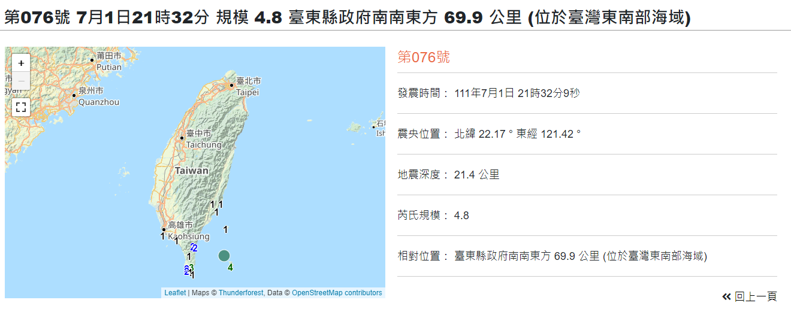
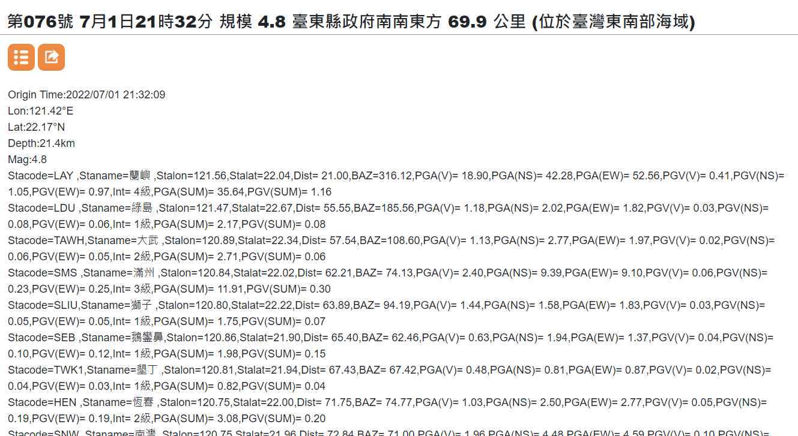
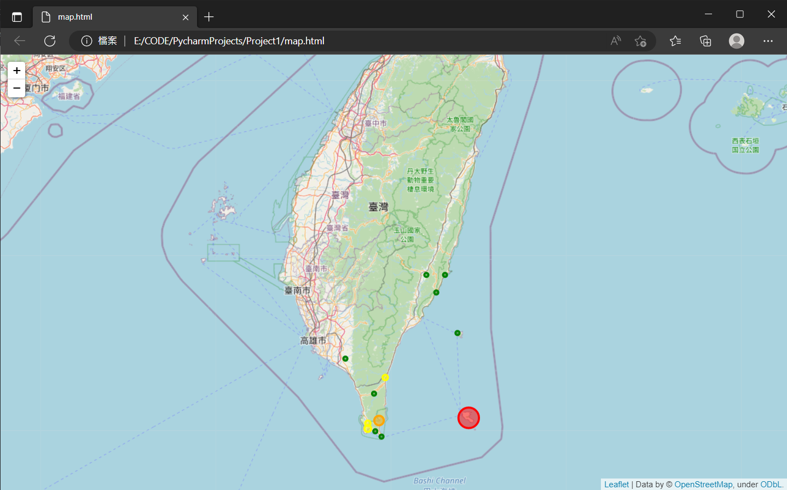
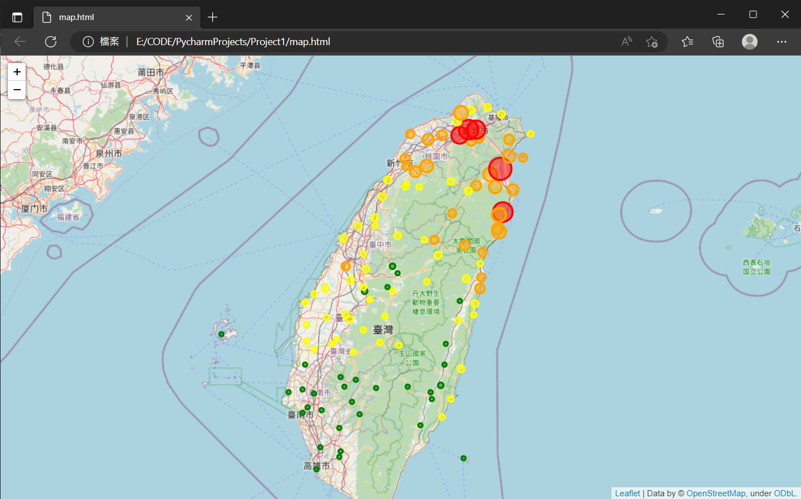

# Python Tutorial Project 1 

## Network Protocols
### HyperText Transfer Protocol (HTTP)
Full text: **HyperText Transfer Protocol** [Wikipedia](https://en.wikipedia.org/wiki/Hypertext_Transfer_Protocol)

### HTTP Response
The first line of all HTTP responses is the status line, which consists of the current HTTP version number, a three-digit status code, and a status description phrase, separated by spaces.
:::info
#### Status Codes
The first digit of the status code represents the class of the response:
```
1xx Informational — Request received, continuing process
2xx Success — The request was successfully received, understood, and accepted
3xx Redirection — Further action needs to be taken to complete the request
4xx Client Error — The request contains bad syntax or cannot be fulfilled
5xx Server Error — The server failed to fulfill a valid request
```
:::

### Client Request
```htmlmixed=
GET / HTTP/1.1
Host: www.google.com
```

### Server Response
```htmlmixed=
HTTP/1.1 200 OK
Content-Length: 3059
Server: GWS/2.0
Date: Sat, 11 Jan 2003 02:44:04 GMT
Content-Type: text/html
Cache-Control: private
Set-Cookie: PREF=ID=73d4aef52e57bae9:TM=1042253044:LM=1042253044:S=SMCc_HRPCQiqyX9j; expires=Sun, 17-Jan-2038 19:14:07 GMT; path=/; domain=.google.com
Connection: keep-alive
```

### HyperText Transfer Protocol Secure (HTTPS)
Full text: **HyperText Transfer Protocol Secure** [Wikipedia](https://en.wikipedia.org/wiki/HTTPS)

:::warning
HTTP is not secure, and attackers can intercept and manipulate communications via methods like eavesdropping and man-in-the-middle attacks. HTTPS is designed to prevent such attacks and is secure when correctly configured.
:::

## Taiwan Earthquake Data Collection and Visualization
### [Central Weather Bureau, Taiwan](https://www.cwb.gov.tw/V8/C/)

### Numbered Earthquakes - Earthquake Parameters Download
[Event 076: July 1, 21:32, Magnitude 4.8, 69.9 km SSE of Taitung County Government (Southeast Offshore of Taiwan)](https://scweb.cwb.gov.tw/zh-tw/earthquake/parameters/2022070121320948076)


### TXT Download URL


```
https://scweb.cwb.gov.tw/zh-tw/earthquake/download?file=%2FdrawTrace%2Foutcome%2F2022%2F2022076.txt
```

#### Notice the latter part of the URL
```
file=%2FdrawTrace%2Foutcome%2F2022%2F2022076.txt
```

#### Observing the format
```
file=%2FdrawTrace%2Foutcome%2F[year]%2F[year][number].txt
```

#### Creating the base URL format
```python
base_URL = 'https://scweb.cwb.gov.tw/zh-tw/earthquake/download?file=%2FdrawTrace%2Foutcome%2F{:04d}%2F{:04d}{:03d}.txt'
```
In the string, **{}** are placeholders for the values to be filled in.
1. **{:04d}**: `d` stands for integer, `4` indicates four digits, and `0` means padding with zeros if necessary. This is for the year.
2. **{:03d}**: `d` stands for integer, `3` indicates three digits, and `0` means padding with zeros if necessary. This is for the earthquake number.

#### Generating the actual URL
```python
year = 2022  # Year
index = 76   # Number
URL = base_URL.format(year, year, index)  # URL
```
Use **format** to insert the corresponding values into the placeholders in the string to generate the URL.
```python
print(URL)
```
```shell
https://scweb.cwb.gov.tw/zh-tw/earthquake/download?file=%2FdrawTrace%2Foutcome%2F2022%2F2022076.txt
```

### Fetching TXT Data
#### Using requests
We need to use the **requests** library to fetch the data.
```python
import requests

response = requests.get(URL)  # Response object
# Text content of the response (string, encoding: ANSI)
Text = response.content.decode('ansi')
```
Split the string by **newline (\n)** and remove **\r**
```python
Text_List = Text.replace('\r','').split('\n')
```
Print the first few lines of information
```python
print(Text_List[0])  # Epicenter
print(Text_List[1])  # Longitude
print(Text_List[2])  # Latitude
print(Text_List[3])  # Depth
print(Text_List[4])  # Magnitude
```
```shell
Origin Time:2022/07/01 21:32:09
Lon:121.42°E
Lat:22.17°N
Depth:21.4km
Mag:4.8
```
Subsequent lines contain **earthquake observation data** from various stations, referred to as **data**.
Process and clean the data.
```python
# Treat the rest of Text_List as data
data = Text_List[5:]
# Split each data string by ','
data = [d.split(',') for d in data]
# Split each parameter in the data by '=' and trim spaces
data = [[i.replace(' ','').split('=') for i in d] for d in data]
# Create dictionaries from the parameters with key-value pairs
data = [{i[0]:i[1] for i in d if len(i)==2} for d in data]
# Remove empty dictionaries
data = [d for d in data if d!={}]
# Output the cleaned data
for d in data:
    print(d)
```
```shell=
{'Stacode': 'LAY', 'Staname': '蘭嶼', 'Stalon': '121.56', 'Stalat': '22.04', 'Dist': '21.00', 'BAZ': '316.12', 'PGA(V)': '18.90', 'PGA(NS)': '42.28', 'PGA(EW)': '52.56', 'PGV(V)': '0.41', 'PGV(NS)': '1.05', 'PGV(EW)': '0.97', 'Int': '4級', 'PGA(SUM)': '35.64', 'PGV(SUM)': '1.16'}
{'Stacode': 'LDU', 'Staname': '綠島', 'Stalon': '121.47', 'Stalat': '22.67', 'Dist': '55.55', 'BAZ': '185.56', 'PGA(V)': '1.18', 'PGA(NS)': '2.02', 'PGA(EW)': '1.82', 'PGV(V)': '0.03', 'PGV(NS)': '0.08', 'PGV(EW)': '0.06', 'Int': '1級', 'PGA(SUM)': '2.17', 'PGV(SUM)': '0.08'}
{'Stacode': 'TAWH', 'Staname': '大武', 'Stalon': '120.89', 'Stalat': '22.34', 'Dist': '57.54', 'BAZ': '108.60', 'PGA(V)': '1.13', 'PGA(NS)': '2.77', 'PGA(EW)': '1.97', 'PGV(V)': '0.02', 'PGV(NS)': '0.06', 'PGV(EW)': '0.05', 'Int': '2級', 'PGA(SUM)': '2.71', 'PGV(SUM)': '0.06'}
{'Stacode': 'SMS', 'Staname': '滿州', 'Stalon': '120.84', 'Stalat': '22.02', 'Dist': '62.21', 'BAZ': '74.13', 'PGA(V)': '2.40', 'PGA(NS)': '9.39', 'PGA(EW)': '9.10', 'PGV(V)': '0.06', 'PGV(NS)': '0.23', 'PGV(EW)': '0.25', 'Int': '3級', 'PGA(SUM)': '11.91', 'PGV(SUM)': '0.30'}
{'Stacode': 'SLIU', 'Staname': '獅子', 'Stalon': '120.80', 'Stalat': '22.22', 'Dist': '63.89', 'BAZ': '94.19', 'PGA(V)': '1.44', 'PGA(NS)': '1.58', 'PGA(EW)': '1.83', 'PGV(V)': '0.03', 'PGV(NS)': '0.05', 'PGV(EW)': '0.05', 'Int': '1級', 'PGA(SUM)': '1.75', 'PGV(SUM)': '0.07'}
{'Stacode': 'SEB', 'Staname': '鵝鑾鼻', 'Stalon': '120.86', 'Stalat': '21.90', 'Dist': '65.40', 'BAZ': '62.46', 'PGA(V)': '0.63', 'PGA(NS)': '1.94', 'PGA(EW)': '1.37', 'PGV(V)': '0.04', 'PGV(NS)': '0.10', 'PGV(EW)': '0.12', 'Int': '1級', 'PGA(SUM)': '1.98', 'PGV(SUM)': '0.15'}
{'Stacode': 'TWK1', 'Staname': '墾丁', 'Stalon': '120.81', 'Stalat': '21.94', 'Dist': '67.43', 'BAZ': '67.42', 'PGA(V)': '0.48', 'PGA(NS)': '0.81', 'PGA(EW)': '0.87', 'PGV(V)': '0.02', 'PGV(NS)': '0.04', 'PGV(EW)': '0.03', 'Int': '1級', 'PGA(SUM)': '0.82', 'PGV(SUM)': '0.04'}
{'Stacode': 'HEN', 'Staname': '恆春', 'Stalon': '120.75', 'Stalat': '22.00', 'Dist': '71.75', 'BAZ': '74.77', 'PGA(V)': '1.03', 'PGA(NS)': '2.50', 'PGA(EW)': '2.77', 'PGV(V)': '0.05', 'PGV(NS)': '0.19', 'PGV(EW)': '0.19', 'Int': '2級', 'PGA(SUM)': '3.08', 'PGV(SUM)': '0.20'}
{'Stacode': 'SNW', 'Staname': '南灣', 'Stalon': '120.75', 'Stalat': '21.96', 'Dist': '72.84', 'BAZ': '71.00', 'PGA(V)': '1.96', 'PGA(NS)': '4.48', 'PGA(EW)': '4.59', 'PGV(V)': '0.10', 'PGV(NS)': '0.13', 'PGV(EW)': '0.22', 'Int': '2級', 'PGA(SUM)': '5.26', 'PGV(SUM)': '0.22'}
{'Stacode': 'EDH', 'Staname': '東河', 'Stalon': '121.30', 'Stalat': '22.97', 'Dist': '89.18', 'BAZ': '172.51', 'PGA(V)': '1.04', 'PGA(NS)': '1.66', 'PGA(EW)': '1.42', 'PGV(V)': '0.03', 'PGV(NS)': '0.05', 'PGV(EW)': '0.05', 'Int': '1級', 'PGA(SUM)': '1.59', 'PGV(SUM)': '0.06'}
{'Stacode': 'SSP', 'Staname': '新埤', 'Stalon': '120.57', 'Stalat': '22.48', 'Dist': '93.91', 'BAZ': '111.40', 'PGA(V)': '1.00', 'PGA(NS)': '0.54', 'PGA(EW)': '0.57', 'PGV(V)': '0.03', 'PGV(NS)': '0.04', 'PGV(EW)': '0.07', 'Int': '1級', 'PGA(SUM)': '0.97', 'PGV(SUM)': '0.07'}
{'Stacode': 'CHK', 'Staname': '成功', 'Stalon': '121.37', 'Stalat': '23.10', 'Dist': '102.40', 'BAZ': '177.47', 'PGA(V)': '0.41', 'PGA(NS)': '1.39', 'PGA(EW)': '1.16', 'PGV(V)': '0.02', 'PGV(NS)': '0.03', 'PGV(EW)': '0.04', 'Int': '1級', 'PGA(SUM)': '1.42', 'PGV(SUM)': '0.04'}
{'Stacode': 'ECS', 'Staname': '池上', 'Stalon': '121.22', 'Stalat': '23.10', 'Dist': '104.03', 'BAZ': '168.73', 'PGA(V)': '0.40', 'PGA(NS)': '0.56', 'PGA(EW)': '0.89', 'PGV(V)': '0.02', 'PGV(NS)': '0.03', 'PGV(EW)': '0.03', 'Int': '1級', 'PGA(SUM)': '0.90', 'PGV(SUM)': '0.04'}

```
**Data** is now ready.

### Visualization
Display the information on a map for reference:
1. Use **Longitude (Stalon)** and **Latitude (Stalat)** as coordinates.
2. Represent observation stations with circular markers.
3. The **Maximum Ground Acceleration, PGA(SUM)** is represented by the radius of the circles.
4. The **Intensity, Int** is represented by the color of the circles.

#### Creating the Map with folium
```python
import folium

# Color definitions
color = ['green', 'green', 'yellow', 'orange', 'red', 'purple']
# Central coordinates of Taiwan
Taiwan_center = [23.97565, 120.9738819]
# Initial zoom level for the world map
zoom = 8

# Create map object
fmap = folium.Map(location=Taiwan_center, zoom_start=zoom)
```

**Start Drawing the Map**
```python
# Iterate over each data entry
for d in data:
    # Longitude
    lon = float(d['Stalon'])
    # Latitude
    lat = float(d['Stalat'])
    # Maximum Ground Acceleration
    PGA = float(d['PGA(SUM)']) * 200 + 1500  # Multiply to scale the small values
    # Intensity
    Int = int(d['Int'][:-1])  # Remove the Chinese character '級'

    # Choose color
    if Int < len(color):
        c = color[Int]  # Within color list range
    else:
        c = color[-1]  # Outside color list range, use the last color

    # Add Circle markers to the map object
    fmap.add_child(folium.Circle(location=[lat, lon],
                                 color=c,  # Circle color
                                 radius=PGA,  # Circle radius
                                 popup='Observation Station',  # Popup content
                                 fill=True,  # Fill the middle area
                                 fill_opacity=0.5  # Set transparency
                                 ))

# Save the map information as an HTML file
fmap.save('map.html')
```
The map information will be saved in **map.html**, which can be opened in a browser.

### Displaying Results
#### Automatically Open the Map using webbrowser
```python
import webbrowser
# Open the map HTML
webbrowser.open('map.html')
```
**Result**



**Result 2**
year = 2022
index = 1


